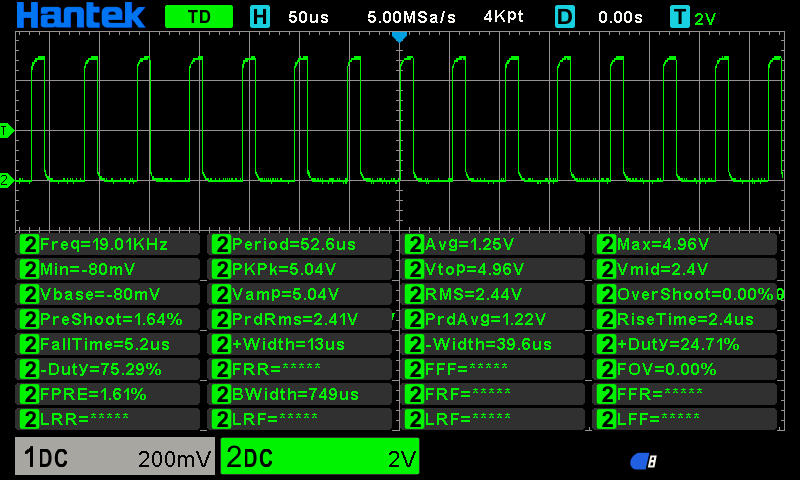
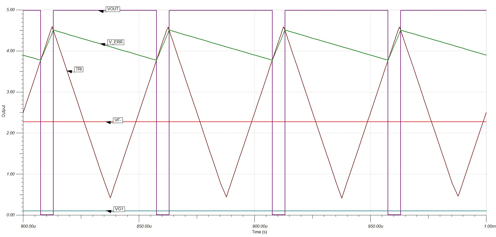
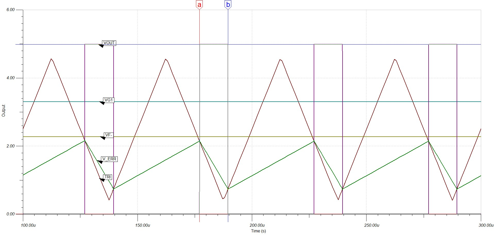

# Boardoza Analog To PWM Converter Breakout Board

The **Boardoza Analog to PWM Converter Breakout Board** is a high-precision signal conditioning board designed to convert an analog voltage input into a proportional **PWM (Pulse Width Modulation)** output signal where the **duty cycle increases or decreases proportionally with the applied input voltage**. Built using high-speed operational amplifiers and comparators, this board operates entirely through dedicated hardware circuitry, enabling ultra-fast response times and reliable signal conversion without requiring any firmware or software processing.

This breakout board is ideal for **motor control systems, throttle signal conversion, industrial automation, power electronics, robotics, and embedded analog control applications**. Its low-latency architecture and robust analog signal path make it suitable for safety-critical and noise-sensitive environments where deterministic signal behavior is essential.

## [Click here to purchase!](https://www.ozdisan.com/ureticiler/boardoza)

|Front Side|Back Side|
|:---:|:---:|
| | |

---

## Key Features

- **Hardware-Based PWM Generation:** Converts analog voltage signals directly into PWM output without requiring a microcontroller.
- **Discrete Analog Design:** Built using precision operational amplifiers and comparators for stable and deterministic operation.
- **Low Latency Signal Path:** Near-instantaneous analog-to-PWM conversion suitable for real-time control systems.
- **Push-Pull CMOS Output:** Provides strong and clean logic-level PWM output compatible with many digital systems.
- **High Noise Immunity:** Reliable operation in electrically noisy environments such as motor drivers and industrial systems.

---

## Technical Specifications

**Model:** Analog to PWM Converter  
**Manufacturer:** Boardoza   
**Manufacturer IC:** Texas Instruments   
**Operational Amplifier Model:** OPA2356  
**Board Type:** Analog Signal Converter    
**Input Voltage (VCC):** 2.7V – 5.5V  
**Analog Input Range:** 0.1V – 4.9V  
**Output Type:** 20kHz PWM (Push-Pull CMOS Logic)  
**Comparator Type:** High-Speed Comparator with Integrated Reference  
**Operational Amplifier Type:** Rail-to-Rail High-Speed Op-Amp  
**Output Short Circuit Current:** 74mA  
**Operating Temperature:** -40°C to +125°C  
**Board Dimensions:** 40mm x 20mm  v

---

## Simulation and Test Results

Simulation and test results are provided below.

| Triangle Wave Output | Error Amplifier Output | PWM Output |
|:---:|:---:|:---:|
|  |  |  |

| Input 100mV | Input 3.3V |
|:---:|:---:|
|  |  |

---

## Board Pinout

### ( J1 ) Power & Analog Input Connector

| Pin Number | Pin Name | Description |
|:---:|:---:|---|
| 1 | VCC | Power Supply Input |
| 2 | INPUT | Analog Voltage Input / Throttle Signal |
| 3 | GND | Ground |

### ( J2 ) PWM Output Connector

| Pin Number | Pin Name | Description |
|:---:|:---:|---|
| 1 | VCC | Power Supply Input |
| 2 | GND | Ground |

---

## Board Dimensions

---

## Step Files

[Boardoza ANALOG to PWM Converter.step](./assets/ANALOG_To_PWM_Converter%20Step.step)

---

## Datasheet

[OPA2356 Datasheet.pdf](./assets/OPA2356xxD%20Datasheet.pdf)

[TLV3052 Datasheet.pdf](./assets/TLV3052AID%20Datasheet.pdf)

---

## Version History

- V1.0.0 - Initial Release

---

## Support

- If you have any questions or need support, please contact support@boardoza.com

---

## **License**
### **Hardware Design**

[![CC BY-SA 4.0][cc-by-sa-shield]][cc-by-sa]

All hardware design files are licensed under [Creative Commons Attribution-ShareAlike 4.0 International License][cc-by-sa].

[cc-by-sa]: http://creativecommons.org/licenses/by-sa/4.0/
[cc-by-sa-shield]: https://img.shields.io/badge/License-CC%20BY--SA%204.0-lightgrey.svg
